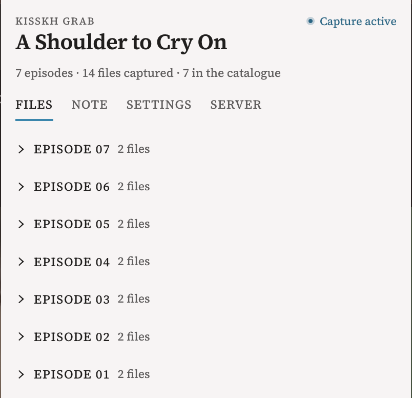
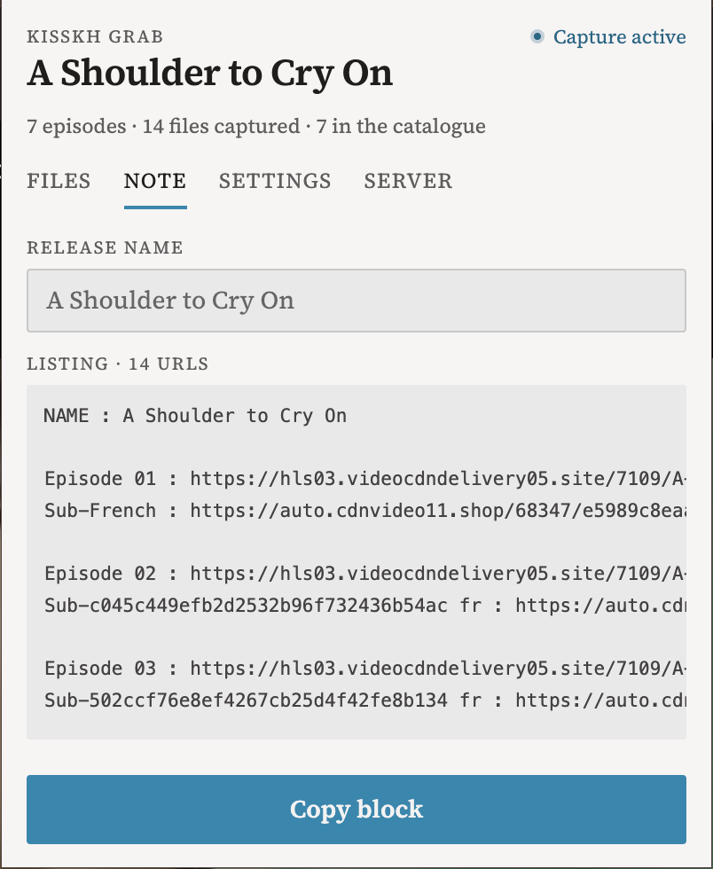
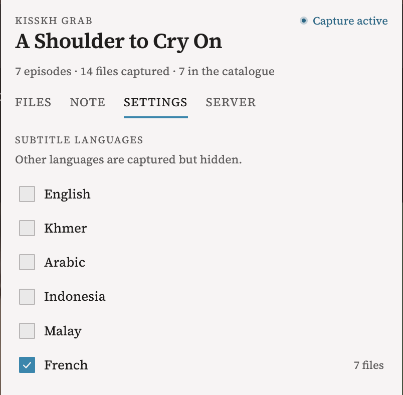
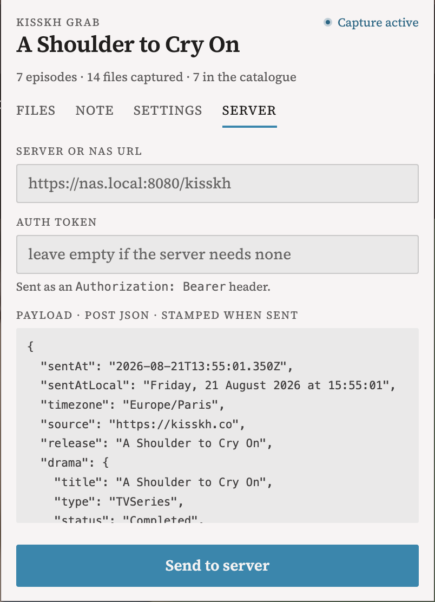

# kisskh helper

A Chrome extension that surfaces the video and subtitle files an episode page
loads, so they can be saved or handed to another tool.

## How it finds things

Nothing is guessed from the page's markup. Two independent paths observe what
actually happens, which is why detection survives the site changing its API:

- **A page hook** runs in the main world at `document_start`, before the site's
  own bundle, and reads the responses the player receives — including the
  subtitle list, which is signed with the player's own `kkey`.
- **A request watcher** in the service worker records every `m3u8`, `mpd`, `mp4`
  and subtitle file the browser downloads, in any frame.

Captures accumulate across a browsing session and are grouped by episode, so
working through a season leaves one list rather than resetting each time. The
list is keyed to the tab and survives a browser restart.

## The four tabs

### Files

Episodes as collapsible groups, each holding its video and its subtitle tracks.

A direct file downloads in one click. **A playlist cannot**: an `.m3u8` is a
list of thousands of segments, not a video, so its action copies a ready-made
command instead — `ffmpeg` or `yt-dlp`, with the `Referer` the CDN requires.

Each row can be renamed, its URL copied, or removed from the list.

### Note

A plain-text listing of every captured URL, grouped by episode with each
episode's subtitles beneath it, ready to paste elsewhere. The release name is
editable and remembered per drama.

### Settings

Which subtitle languages to show. Filtering happens when the list is **read**,
not when a track is captured, so changing the selection applies to everything
already seen instead of only to what comes next. A track the page gives no
language to is always kept.

### Server

POSTs the whole listing as JSON to a server or NAS of your choosing, stamped
with the moment it left. An auth token is optional and travels as an
`X-Token` header.

```json
{
  "sentAt": "2026-08-21T13:55:01.350Z",
  "sentAtLocal": "Friday, 21 August 2026 at 15:55:01",
  "timezone": "Europe/Paris",
  "source": "https://kisskh.co",
  "release": "A Shoulder to Cry On",
  "drama": { "title": "…", "type": "…", "status": "…", "country": "…" },
  "episodes": [
    {
      "number": 1,
      "videos":    [{ "url": "…", "format": "MP4", "filename": "…", "durationSeconds": 3852 }],
      "subtitles": [{ "url": "…", "format": "SRT", "language": "French", "filename": "…" }]
    }
  ],
  "counts": { "episodes": 7, "files": 14, "videos": 7, "subtitles": 7 }
}
```

The payload is shown in full before sending, and a refusal reports the server's
own status and message rather than a generic failure.

## Install

```sh
bun install
bun run build
```

Then load `dist/chrome-mv3/` through **Load unpacked** in `chrome://extensions`.

## Permissions

| Permission | Why |
| --- | --- |
| `storage` | The captured list, the language choice, the server settings |
| `webRequest` | Observing what the page downloads |
| `downloads` | Saving a direct file |
| `<all_urls>` | The stream is served by a CDN whose host is not known in advance |

## Development

```sh
bun run dev        # live-reloading build
npx tsc --noEmit   # `wxt build` does not typecheck; run this too
```

Built with [WXT](https://wxt.dev), React and Tailwind. The interface follows the
project's own design system, vendored under `entrypoints/popup/ds.css`.

## Screenshots





